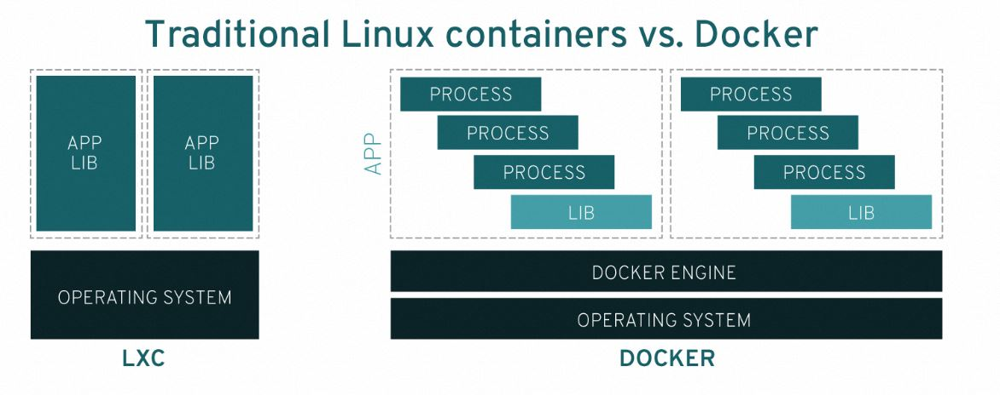

##Docker 是什么：
以下简要说明 Docker 以便区分：

IT 软件"Docker"是支持创建和使用 Linux® 容器的容器化技术。
开源 Docker 社区致力于改进这类技术，并免费提供给所有用户，使之获益。
Docker Inc. 公司凭借 Docker 社区产品起家，主要负责提升社区版本的安全性，并将技术进步与广大技术社区分享。此外，它还专门对这些技术产品进行完善和安全固化，以服务于企业客户。
借助 Docker，您可将容器当做轻巧、模块化的虚拟机来使用。同时，您还将获得高度灵活性，实现对容器的高效创建、部署及复制，并在环境之间迁移它们，从而有助于您针对云来优化应用。

## Docker 原理：
- Docker 技术使用 Linux 内核和内核功能（例如 Cgroup 和命名空间）来分隔进程，以便各进程相互独立运行。这种独立性正是采用容器的目的所在；它可以独立运行多种进程、多个应用，更加充分地发挥基础设施的作用，同时保持各个独立系统的安全性。
- 容器工具（包括 Docker）可提供基于镜像的部署模式。这使得它能够轻松跨多种环境，与其依赖程序共享应用或服务组。Docker 还可在这一容器环境中自动部署应用（或者合并多种流程，以构建单个应用）。
- 此外，由于这些工具基于 Linux 容器构建，使得 Docker 既易于使用，又别具一格，因此它可为用户提供前所未有的应用访问权限、快速部署以及版本控制和分发能力。
###Linux 容器：
Linux® 容器是与系统其他部分隔离开的一个或一组进程。运行这些进程所需的所有文件都由另一个特定镜像提供，意味着从开发到测试再到生产整个过程中，Linux 容器都是可移植且一致的。因此，相对于依赖重复传统测试环境的开发渠道，使用容器速度要快得多。容器比较普遍也易于使用，因此也成了 IT 安全方面的重要组成部分

###为什么需要 Linux 容器？
假设您在开发一个应用。您使用的是一台笔记本电脑，而且您的开发环境具有特定的配置。其他开发人员身处的环境配置可能稍有不同。您正在开发的应用不止依赖于您当前的配置，还需要某些特定的库、依赖项和文件。与此同时，您的企业还拥有标准化的开发和生产环境，有着自己的配置和一系列支持文件。您希望尽可能多在本地模拟这些环境，而不产生重新创建服务器环境的开销。因此，您要如何确保应用能够在这些环境中运行和通过质量检测，并且在部署过程中不出现令人头疼的问题，也无需重新编写代码和进行故障修复？答案就是使用容器。
容器可以确保您的应用拥有必需的库、依赖项和文件，让您可以在生产中自如地迁移这些应用，无需担心会出现负面影响。实际上，您可以将容器镜像中的内容（使用 Buildah 等开源工具创建）视为 Linux 发行版的一个安装实例，因为其中完整包含 RPM 软件包、配置文件等内容。但是，安装容器镜像发行版，要比安装新的操作系统副本容易得多。这样可以避免危机，做到皆大欢喜

Linux 容器的价值在于，它能加速开发并满足新出现的业务需求。在某些情形中（如通过 Apache Kafka 进行实时数据流处理），容器是不可或缺的，因为它们是提供应用所需的可扩展性的唯一途径。无论基础架构是在企业本地还是在云端，或者混合使用两者，容器都能满足您的需求

###虚拟机和容器的区别是什么
- 虚拟化使得您的操作系统（Windows 或 Linux）可同时在单个硬件系统上运行。 
- 容器则可共享同一个操作系统内核，将应用进程与系统其他部分隔离开。例如：ARM Linux 系统运行 ARM Linux 容器，x86 Linux 系统运行 x86 Linux 容器，x86 Windows 系统运行 x86 Windows 容器。Linux 容器具有极佳的可移植性，但前提是它们必须与底层系统兼容。
- 对于新手而言，虚拟化会使用虚拟机监控程序模拟硬件，从而使多个操作系统能够并行运行
- Linux 容器在本机操作系统上运行，与所有容器共享该操作系统，因此应用和服务能够保持轻巧，并行化快速运行。

##Docker 并不等同于传统的 Linux 容器 
- Docker 并不等同于传统的 Linux 容器 

## Docker 容器的优势是什么
- 模块化
Docker 容器化方法注重在不必停止整个应用的情况下，单独提取部分应用进行更新或修复的能力。除了这种基于微服务的方法，您还可以采用与面向服务的架构（SOA）类似的方法，在多个应用间共享进程。

- 层和镜像版本控制
每个 Docker 镜像文件都包含多个层，它们组合成一个镜像。每当镜像发生改变时，就会创建一个新的镜像层。每当用户指定命令时，例如 run 或 copy，就会创建一个新的层。
Docker 可重复利用这些层来构建新容器，因而加快了构建过程。镜像之间共享中间变化，进一步提升了速度、规模以及效率。版本控制也是层所固有的功能：每次发生新的更改时，您大都会获得一个内置的更改日志，拥有对容器镜像的全盘管控。

- 回滚
回滚也许是层最值得一提的功能。每个镜像有多个层。不喜欢镜像的当前迭代？将它回滚到上一版本。这一功能还支持敏捷开发方法，帮助实现持续集成和部署（CI/CD），使其在工具层面成为一种现实。

- 快速部署
新硬件的启用、运行、置备和供应在过去需要耗费数日，所需的投入和开销也很繁重。基于 Docker 的容器可以将部署缩短到只用几秒。通过为每个进程创建容器，您可以快速将这些进程共享给新的应用。而且，添加或移动容器时无需重启操作系统，大大缩短了部署时间。除了部署时间更短外，您还可以轻松无虞、经济高效地创建和销毁容器创建的数据。

因此，Docker 技术是一种更加精细、可控、基于微服务的技术，可为企业提供更高的效率价值。

##使用 Docker 有什么局限
Docker 本身能够管理单个容器。但随着您开始使用越来越多的容器和容器化应用，并把它们划分成数百个部分，很可能会导致管理和编排变得困难。最终，您需要后退一步，对容器实施分组，以便跨所有容器提供诸如网络、安全和遥测等服务。于是，Kubernetes 应运而生。

